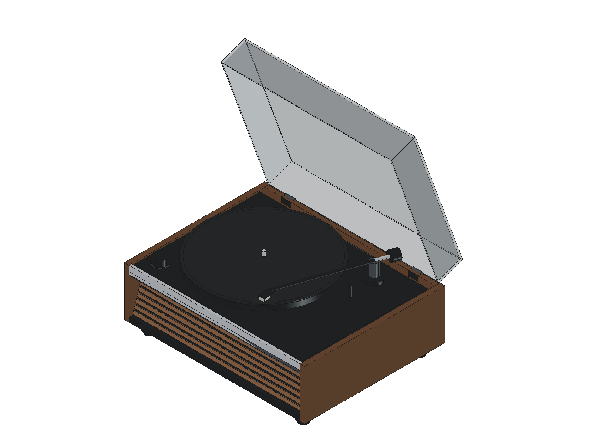

# 黑胶唱片机 · LUMI 参考外形

基于 [HYM LUMI Walnut 官方资料](https://www.hym-originals-en.com/products/lumi-turntable-walnut)制作的一低音两全频的一体式唱片机概念 CAD。外形与扬声器布局基线为 **v0.6 AC 插座预留布局**；当前装配入口为 **v0.3 选定弯臂机芯核对版**。扬声器、变压器和功放板已采用用户提供的外廓尺寸；机芯尺寸及各部件安装接口仍待确认。



## 模型选择

| 文件 | 用途 |
|---|---|
| [弯臂机芯核对版](cad/lumi-selected-mechanism-fit.FCStd) | 查看所选机芯的整体布局时优先打开；安装方案仍待核对 |
| [三单元基线](cad/lumi-three-driver.FCStd) | 外壳、音响与电子布局的生成基线，也是核对版的输入，须保留 |

两份文件均可独立打开，但不是实时关联文档；更新基线后需重新生成核对版。旧版 `cad/lumi-dual-driver.FCStd` / `.step` 已移除，需要对照时可从 Git 历史找回。

## 分组平面图纸

当前模型已整理为 **3 份 A3 矢量 PDF，共 34 页**：

- [整机与外壳（12 页）](output/pdf/01-assembly-and-enclosure.pdf)：木板整数备料汇总、闭盖六面图与外壳各零件。
- [音腔与内部结构（8 页）](output/pdf/02-acoustic-and-structure.pdf)：隔板、音腔顶板、倒相管、浮动台面与支承。
- [机芯与电子部件（14 页）](output/pdf/03-mechanism-and-electronics.pdf)：扬声器、电源、功放、选定弯臂机芯及通用机芯对照。

图纸标明长 X、宽 Y、高 Z、厚度或厚度状态，并补充已有开孔、定位和同形件数量。未知的壁厚与安装尺寸不作推定；当前仍是概念与空间核对图。详见[读图说明与重新生成方法](docs/drawing-pack.md)。

## 指定机芯装配核对

已按“28高端弯臂机芯全套餐装好直接用 自动回臂”建立 [FreeCAD](cad/lumi-selected-mechanism-fit.FCStd) / [STEP](cad/lumi-selected-mechanism-fit.step) 示意装配，见 [选型说明与重建方法](docs/selected-mechanism.md)。尺寸图是直臂配图，355 × 280 mm 尚不能视为弯臂款已确认尺寸；暂定 45 mm 下探包络与现有结构重叠，安装方案未放行。

[弯臂预览](previews/selected-mechanism-open.png) · [空间核对图](previews/selected-mechanism-clearance.png) · [核对报告](cad/mechanism-fit-report.json)

## v0.6 基线交付内容

| 文件 | 用途 |
|---|---|
| [FreeCAD 装配](cad/lumi-three-driver.FCStd) | 64 个独立零件，按结构分组，可隐藏、移动和进一步建模 |
| [STEP 装配](cad/lumi-three-driver.step) | 毫米制实体交换，共 75 个实体；三个扬声器各含 4 个子实体 |
| [三视尺寸图 SVG](previews/dimensions.svg) / [PNG](previews/dimensions.png) | CAD 实体投影，含外廓和唱盘尺寸；不是加工图 |
| [闭盖](previews/closed.png) / [开盖](previews/open.png) / [内部布局](previews/internal.png) | 实际 FreeCAD 视口渲染 |
| [底部低音安装](previews/bottom.png) | 低音朝下，底板预留圆孔 |
| [俯视](previews/top.png) / [正视](previews/front.png) / [右视](previews/right.png) | 外形与布局核对 |
| [主要参数](cad/parameters.json) | 修改后通过脚本重建 |
| [零件清单](cad/parts.csv) | 材料说明、包络尺寸和估算标记 |
| [木板备料清单](cad/wood-cut-list.csv) | 22 块 / 条板件，整数矩形备料长宽、名义板厚、数量及后续修切说明 |
| [设计依据](docs/design-basis.md) | 官方资料、估算边界与后续选型要求 |
| [验证报告](cad/validation.json) | 实体、关键尺寸、干涉及 STEP 回读结果 |

外观包含胡桃木色侧板、后倾横格栅、银色前沿、黑色台面、左前旋钮、唱盘与唱臂包络、烟灰透明翻盖和脚垫。内部使用 Shockwave SC-2103 拆机件：**左右全频朝前，低音移到后排朝下**。两道全深隔板分出贯通前后的中央低音腔，左右前部各为一个独立密闭试验腔，电路移至左右后部。低音倒相管从后板引出，内径 32 mm、初始长度 160 mm，可换长度试调。v0.5 将箱体平面外廓调整为 450 × 350 mm，木壳自身高度保持 124 mm。


低音腔几何毛容积约 **4.72 L**，扣除所有已建模占用（含实心安装包络和倒相管）后保守净容积约 **4.18 L**；左右全频腔各约 **1.13 L**。这些是 CAD 空间估计，尚未扣吸音材料、支柱、密封件及线缆，不是实测声学容积。原箱和倒相管已遗失，没有 T/S 参数；管径、管长与左右密闭方案均为待测初值。详细坐标、拆装方式和验证边界见 [SC-2103 音腔设计](docs/audio-layout.md)。

[后置倒相口预览](previews/rear.png)

左右全频腔当前没有倒相管；可封堵、可换管接口仅为后续讨论方案，尚未建模，见[全频腔的后续方案](docs/audio-layout.md#左右全频腔的后续方案)。接手当前成果时先读[工作交接](docs/current-work-handoff.md)。

## AC 电源插座预留

已依据用户提供的 8-F5 图纸，在左后板横装预留 **48 × 28 mm、R3** 通孔，附上下 **2 × Ø4.5 mm、孔距 40 mm** 固定孔。中心 X=70、Z=108 mm，距后板自身左边 58、下边 70 mm。端子后另留 20 mm 接线空间（暂估），与变压器和承托梁几何间距各 6 mm；现有部件位置不变。

[合并参考图](references/ac-inlet/8-f5-combined.png) · [原图、选型条件与孔位说明](references/ac-inlet/README.md) · [插座与电源线购买链接及 SKU](references/ac-inlet/README.md#购买链接) · [隐藏插座后的后板孔预览](previews/rear-cutouts.png)

该两芯 C8 仅为机械候选件，不提供保护接地；整机绝缘、变压器一次侧规格、保险丝、端子护套及实际板厚适配尚待确认，未放行市电接入和生产加工。合图中的细字可能重绘，尺寸以保存的两张原图及参数记录为准。

电源线目前仅登记购买链接，具体规格与适配性尚未核对，未加入 CAD。修改插座开孔参数后，备料表的文字说明仍可能保留默认尺寸，详见[已知问题与待修项](docs/current-work-handoff.md#已知问题与待修项)。

## 木板加工尺寸

箱体平面采用 450 × 350 mm；侧板 350 × 124 × 12、底板 426 × 350 × 12、后板 426 × 112 × 12、浮动台面 418 × 314 × 6 mm。格栅为 426 × 7 × 3 mm 矩形条，整体后倾 18°，竖向节距 11 mm。

斜障板采用真实法向厚 8 mm，矩形备料 426 × 98 × 8 mm，之后修上下斜口至安装竖高 90 mm；两道低音隔板各备料 314 × 90 × 8 mm，按精确斜前缘修切。图册同时保留成形包络与整数备料，不能逐项四舍五入斜切坐标。名义板厚、贴皮、拼接与装配余量须在材料和工艺确定后实测确认，当前未增加未定义的榫槽、固定孔或通用间隙。

## v0.6 基线参数与精度

机壳外廓为 **450 × 350 × 214.2 mm**，含 AC 插座法兰总深 **351.88 mm**（不含外接插头和线缆），唱盘直径 **300 mm**，唱臂轴距 **200 mm**，有效长度 **218 mm**。

**214.2 mm 暂解释为闭盖总高**，官网图示未明确测量基准。木壳高度分配、板厚、格栅间距、防尘盖与内部件尺寸均为估算；扬声器口端外径与总高采用用户于 2026-09-21 提供的尺寸，见下表；开孔和 3 mm 边沿厚度仍为估算。口端外径暂对应模型法兰外径，不代表振膜直径或名义英寸规格。

| 占位 | 数量 | 口端外径 | 总高（含边沿） | 暂定开孔直径 | 向箱内预留深度 |
|---|---:|---:|---:|---:|---:|
| 低音，底部朝下 | 1 | 132 mm | 65 mm | 100 mm | 62 mm |
| 全频，前部左右 | 2 | 78 mm | 40 mm | 40 mm | 37 mm |

总高按喇叭口朝下测量时的轴向高度理解；安装方向维持低音朝下、全频朝前。法兰向箱外伸出暂估的 3 mm，已计入总高。低音的最低点离桌面 23 mm，暂留作出声空间，声学效果及防护网厚度后续验证。安装孔只开概念圆孔，未确定螺孔位置。`parameters.json` 中的 `woofer`、`fullrange` 和 `acoustic_divider_x` 可分别调整单元尺寸、位置和隔板位置；`total_height` 是总高，箱内深度由总高减 `flange_thickness` 得到。

三个扬声器共用一个电源变压器，本体按用户提供的 **60 × 55 × 50 mm**，底部固定耳总长 **88 mm** 建模。放在左后部电源区，底面贴合底板上表面 Z=38 mm。本体与固定耳共用底面，总包络为 **88 × 55 × 50 mm**；固定耳暂按沿长边对称伸出、每侧 14 mm，宽 55 mm、厚 2 mm 作保守占位，尚未开固定孔。孔距、耳宽厚及高度基准需实物核对，散热、走线和磁场对唱头/唱放的影响未验证。尺寸与位置由 `power_transformer` 参数控制。

功放板采用用户提供的**含散热片整体尺寸 125 × 75 × 45 mm**，放在后部右侧，水平旋转 90°，沿 X/Y/Z 的包络为 75 / 125 / 45 mm。沿用离底板 10 mm 的暂估支承空间，包络底面 Z=48 mm、顶面 Z=93 mm；没有在 45 mm 之外再叠加散热片。`amplifier` 参数控制尺寸、位置及底部间隙；孔位、支柱、散热片细节和端子插拔空间待确认。

FCStd 保留独立的 `Part::Feature` 实体；主参数由 JSON 驱动脚本重建，**没有完整的草图约束和自动联动特征历史**。可以在 FreeCAD 中继续直接编辑零件，或修改 JSON 后重新生成。部分细部偏移量在建模脚本中。重建不会保留手动修改，应先另存自己的版本。

## v0.6 基线重建

使用 FreeCAD **1.1.1** 验证。输出写回当前仓库的 `cad/` 和 `previews/`。

1. 按需修改 `cad/parameters.json`。
2. 将手动改动另存后，关闭基线文件，包括重新打开后名称为 `lumi_three_driver` 等的文档。基线脚本仅按 `LumiThreeDriver` 文档名阻止重建，不检查重新打开的文件路径。
3. 在 FreeCAD 的「宏 → 宏」中选择并执行 `tools/build.FCMacro`。它依次生成 FCStd、STEP、清单、预览和尺寸图。
4. 重新执行下方验证命令，使报告与修改后的模型保持一致。
5. 如需同步弯臂机芯装配，接着按[专题说明](docs/selected-mechanism.md#后续适配与重建)运行 `tools/mechanism-study.FCMacro`。它依赖刚保存的基线，不会自动重建基线。

宏每次直接读取三个本地模块的源代码，支持同一 FreeCAD 会话中修改脚本后重跑。生成参数快照保存在 `GeometryDatums.BuildParametersJSON` 中；改动参数却未重建、或模型缺少快照、预检查所列的尺寸基准及安装对象/属性时，验证会先写入 `passed: false` 和具体原因，覆盖旧报告并提示重新生成模型；命令以非零状态退出，验证打开的文档会关闭。报告分别记录模型版本 `revision` 与请求版本 `requested_revision`。

本机也可以用终端启动宏：

```sh
open -a FreeCAD --args "$PWD/tools/build.FCMacro"
```

命令适用于 FreeCAD 尚未运行时；已经运行时直接在宏窗口执行。脚本使用宏本身所在位置寻找仓库，不依赖终端工作目录。

无图形界面时可只生成几何与 STEP：

```sh
PYTHONPATH=/Applications/FreeCAD.app/Contents/Resources/lib \
  /Applications/FreeCAD.app/Contents/Resources/bin/python tools/build_model.py
```

该方式不输出渲染、颜色和图形视图；要获得完整交付，请执行 GUI 宏。

## 验证范围

当前 FreeCAD 环境执行 20 项用例，其中 PDF 依赖用例明确跳过，其余 19 项通过；PDF 比例用例在独立 PDF 环境补跑通过。测试覆盖宏重载、参数快照、保存实体尺寸、变压器与功放干涉、非默认尺寸标注，音腔泄漏、缩短全频腔、电子件入腔后的净容积扣除、倒相管堵塞、120／160／200 mm 三种试验管长，以及机芯核对版的覆盖保护和下探深度。旧模型、缺少属性及无效快照的测试同时核对失败报告覆盖、命令行退出和文档关闭。测试在临时目录运行，不覆盖交付文件：

```sh
PYTHONPATH=/Applications/FreeCAD.app/Contents/Resources/lib \
  /Applications/FreeCAD.app/Contents/Resources/bin/python -m unittest discover -s tests -v
```

v0.6 基线的几何验证（不覆盖选定机芯核对版）：

```sh
PYTHONPATH=/Applications/FreeCAD.app/Contents/Resources/lib \
  /Applications/FreeCAD.app/Contents/Resources/bin/python tools/validate_model.py
```

v0.6 报告通过全部 **38 项检查**，包括：实体有效性、一低音两全频数量与参数、沿各单元轴线回读的实际外径与总高、生成参数快照一致性、必需模型属性、外廓、唱盘直径、唱臂轴距及有效长度、三音腔独立封闭性、倒相管尺寸与气路、闭盖净空、开盖抽样、关键内部包络、实心安装空间、低音离桌面间隙、变压器本体及固定耳包络尺寸、底板支承与空间避让、功放板含散热片尺寸与避让、STEP 回读实体数、体积与边界一致性，新增插座孔形、包络、干涉、接线预留与法兰支承检查，以及木板真实法向厚度、整数备料包容关系和矩形格栅节距与间隙。闭盖到机芯包络的最小距离为 **11 mm**。

开盖以 5° 步长检查 0–70° 的位置，不是连续运动学验证。内部检查覆盖喇叭实心圆柱安装包络与机芯、电路板、隔板及外壳，另检查轴承、马达和电子板的指定边界，不代表所有装配细节已放行。音腔已用保存的几何检查独立封闭性与保守净容积，但实际声学容积、扬声器参数匹配、声反馈、隔振性能、驱动与电气功能尚未验证。

具体未完成安装工作见[后续适配](docs/selected-mechanism.md#后续适配与重建)，加工前资料清单见[设计依据](docs/design-basis.md#进入加工前必须补齐)。SC-2103 具体版本、原功放分频和单元参数仍需核实。进入加工前需补齐扬声器开孔和安装图，并补齐已选弯臂机芯的真实安装图、材料、连接方式和公差。**本版不能直接作为原厂精确复刻或生产加工图。**
