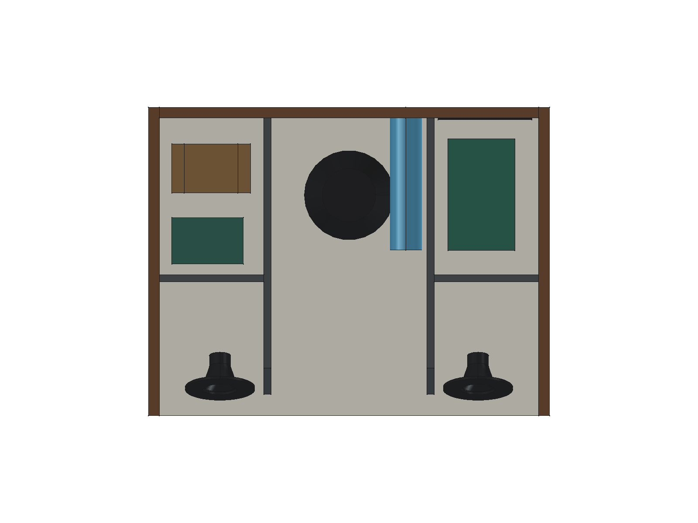
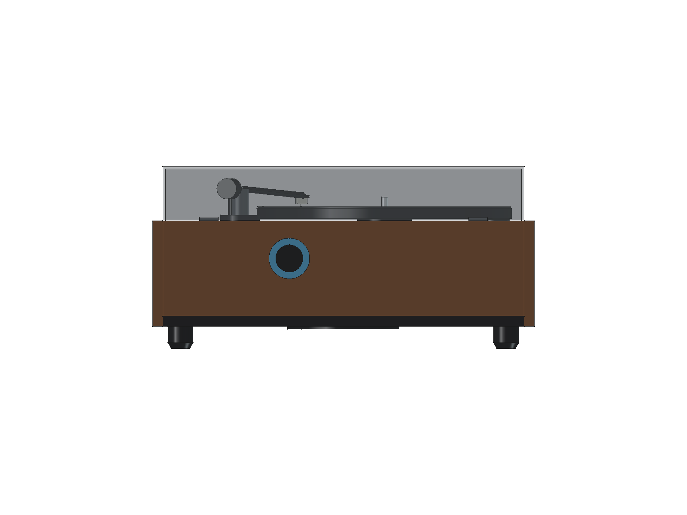

# SC-2103 三音腔布局

2026-09-21，v0.4-sc2103-layout。用户确认扬声器来自 Shockwave SC-2103，原低音箱、卫星箱和倒相管均已遗失，授权按唱机外廓重新设计。该版交付空间方案及可换管试验结构，尚未完成声学调谐或加工放行。

## 布置与尺寸

外廓保持 448.6 × 345.5 × 214.2 mm。坐标原点为左前方桌面，X 向右、Y 向后、Z 向上，单位均为 mm。

| 项目 | 当前布置 |
|---|---|
| 左右全频单元 | 口端 Ø78、总高 40；中心 X=80 / 368.6、Z=88，朝前安装于后倾 18° 的障板 |
| 后排低音 | 口端 Ø132、总高 65；中心 X=224.3、Y=247，安装面 Z=26，朝下；最低点距桌面 23 |
| 中央低音腔 | 净宽 174.6，X=137–311.6；从斜面障板内侧延伸至后板内面 Y=333.5；底面 Z=38、顶面 Z=128 |
| 左右全频腔 | 各净宽 117；斜面障板至 Y=150，Z=38–128；相互及与低音腔不通气，先采用密闭试装 |
| 分隔结构 | 两道 8 mm 全深隔板位于 X=129–137 / 311.6–319.6；左右后隔板 Y=150–158；8 mm 声腔顶板 Z=128–136 |
| 左后变压器 | 固定耳保守包络 X=26–114、Y=249.5–304.5、Z=38–88 |
| 左侧备用电子区 | X=26–106、Y=170–222、Z=48–65；在机芯核对版中不代表另需唱放 |
| 右后功放 | 含散热片 125 × 75 × 45，平放旋转 90°；X=335–410、Y=185–310、Z=48–93 |
| 后接口占位 | 移至右侧 X=324–429，与中央低音倒相管分开；实际接口开孔和插拔空间未设计 |

后部承托梁分成左右两段，中央利用音腔顶板承托原有后支点。低音腔顶板为通用机芯轴承增加封闭避让杯，外半径 14、内半径 12、底面 Z=110、内底面 Z=112。它只适用于基线的通用轴承占位，不能作为选定弯臂机芯的适配证据。

## 体积与计算口径

以下由 [保存模型验证报告](../cad/validation.json)计算，并非根据外廓长宽高直接估计。

| 音腔 | 几何毛容积（已扣封闭避让杯） | 扣除安装包络和倒相管后的保守净容积 |
|---|---:|---:|
| 中央低音 | 4.623 L | 4.079 L |
| 左全频 | 1.173 L | 1.136 L |
| 右全频 | 1.173 L | 1.136 L |

验证时只临时封住设计的单元开孔和倒相口，从保存的板件中求出三个互不连通的封闭空间。净容积扣除所有已建模部件在腔内的占用；扬声器使用实心圆柱安装包络，变压器使用包含固定耳上方空间的完整包络，倒相管扣除整个外廓（包括管内空气）。重叠占用通过布尔差集只扣一次，避免漏扣移入音腔的电子件，也避免把空心盆架当作几乎不占容积的部件。未计尚未建模的吸音材料、支柱、密封件和线缆；实物轮廓及这些附加占用仍会改变有效容积。封闭几何不代表实物拼缝已经气密。

此前中央低音腔几何毛容积约 1.53 L；当前约 4.62 L。这个增长说明空间利用改善，不代表低频性能提高了相同比例。

## 后置可换倒相管

- 初始内径 32、壁厚 2、外径 36；总物理长度 160，包含后板内的部分，不另加板厚。
- 轴线 X=288、Z=106，沿 Y 方向。外口在后板外面 Y=345.5，内口 Y=185.5；从后板内面向腔内伸入 148。
- 法兰外径 48、厚 3，沉入后板保持外廓。整体从后方抽出、更换不同长度的管件；不用胶将管永久粘死。图中配合是名义贴合，密封圈、紧固件、加工间隙与两端圆角尚未细化。
- 已检查 120、160、200 三种物理长度；三者在当前基线均可容纳，管内及内端前方一个管内径长度的圆柱区域不被安装包络和结构阻挡。改变长度后须重建和复验，净容积随管道占用变化。
- 左右全频腔先密闭试装，后隔板保留为独立件，便于样机阶段调整。不能直接向后方电子区打孔充当卫星箱倒相口，否则会改变腔体边界和有效容积。

32 × 160 是受空间约束的试验初值，未取得 SC-2103 单元的 Fs、Qts、Vas、振幅限制或原功放分频曲线，没有据此承诺调谐频率、低频截止、声压或允许功率。小管径在较大音量时可能产生气流声，需要在样机上测量后决定是否改管径或改用密闭方案。

参考 [Eminence 箱体设计说明](https://eminence.com/blogs/blog/cabinet-recommendations)：后置倒相口可行，但摆放与背后墙面会影响表现，管口必须保持畅通；增大容积、降低调谐也会改变单元机械负担。本项目没有把其他品牌单元的推荐容积或调谐数值套用到 SC-2103。

## 验证与后续试装

基线检查涵盖三个独立音腔、管道尺寸与气路、扬声器实心安装空间、电子包络和 STEP 回读。回归测试故意在隔板开孔及堵住倒相管，确认检查确实能发现问题，并覆盖三种试验管长。音腔探测点随当前前后边界、隔板和高度变化；回归测试覆盖后隔板前移至 Y=100 mm，以及功放、变压器分别移入低音腔后的净容积扣除。GUI 渲染后的唱盘直径使用精确几何边界读取，避免显示三角网格造成尺寸误报。

装机先确认单元悬边与音圈状态、真实开孔及原功放输出接线，再用低音量进行频响、漏气和异响检查。用可拆管和可封堵口对比不同方案；保持相同音量与摆位，依据测量选择，不以“低音更响”代替整体响应判断。唱针落盘播放时还要独立检查声反馈及隔振。

选定弯臂机芯的 355 × 280 × 45 mm 下探包络仍是未经确认的假设，与扩展声腔顶板、倒相管等重叠；[核对报告](../cad/mechanism-fit-report.json)继续标记 `installation_released=false`。取得实物底部轮廓后再决定局部避让、顶板高度和管道走向，不能按当前报告直接加工整机。

## 重建入口

修改 `cad/parameters.json` 的 `fullrange`、`woofer`、`acoustic`、`acoustic_divider_x`、`bass_port` 及电子部件参数，按 [README](../README.md#v04-基线重建)先重建并验证基线，再重建机芯核对版。`TweeterLeft` / `TweeterRight` 仅保留为稳定对象 ID，其角色与显示名称已改为全频。更换管长不会自动更新保存的静态实体。
