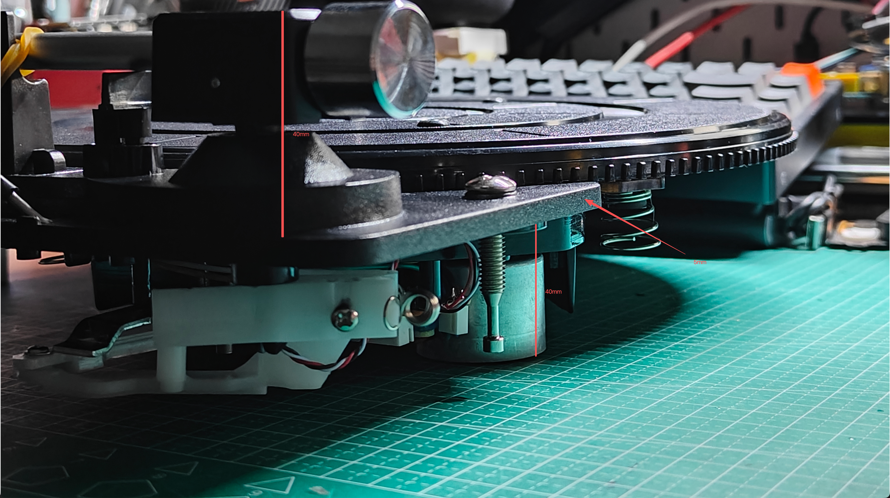
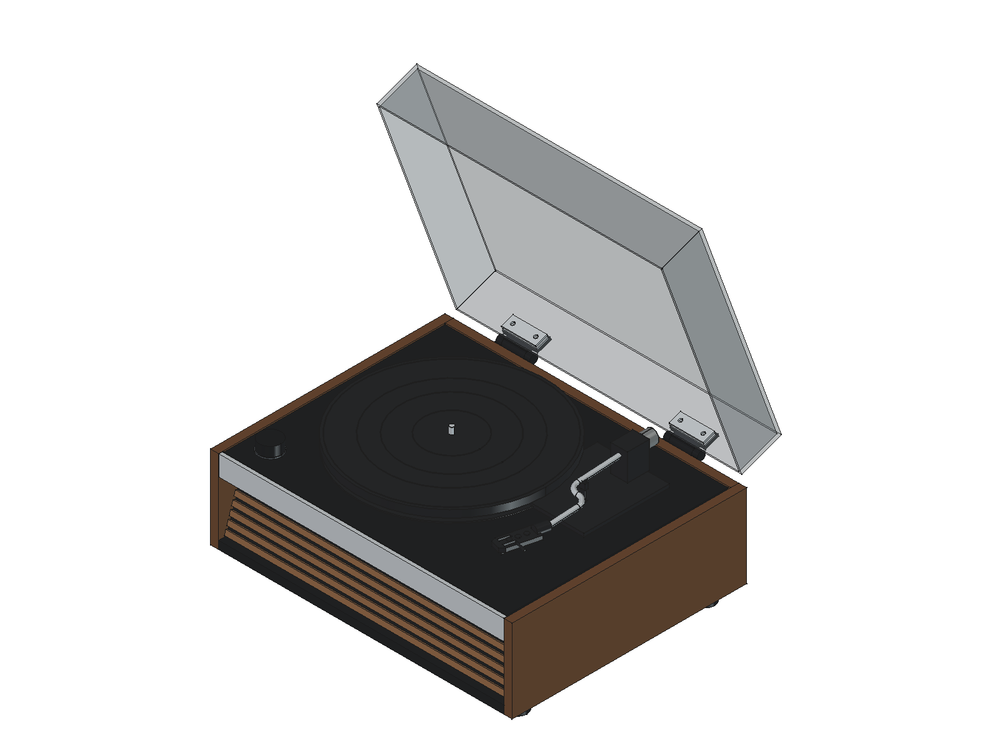
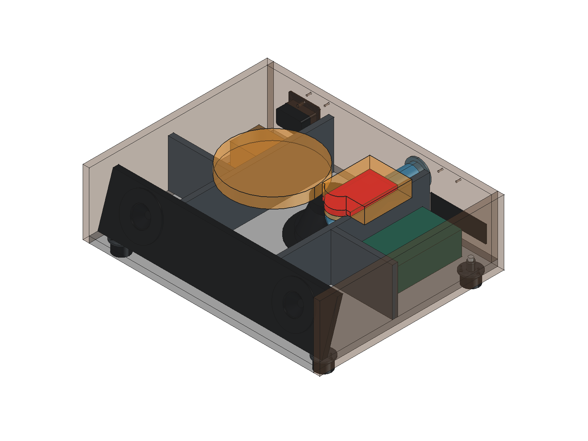
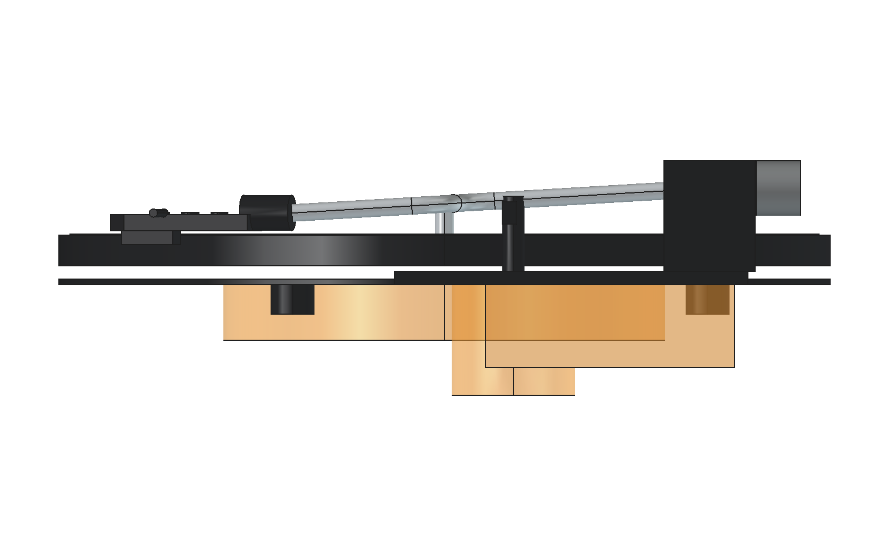

# 弯臂机芯与装配核对

选型为淘宝商品 `712086565319`、SKU `5162746531784` 的 **“28高端弯臂机芯全套餐装好直接用 自动回臂”**。套装图片包含机芯、功放板、机芯线、RCA 后板和电源线。商品详情未能读取，以下以用户提供的图片为依据；电气参数尚未确认。

## 尺寸依据

2026-09-24 用户收到实物，确认除弯形唱臂外，其余结构与原直臂配图一致，并确认唱头指托不会越过机芯基座右侧。原图的 355 mm 总宽据此沿用；唱盘厚度改用实测 11 mm。机芯整体向右移动 12 mm，使 355 mm 基座在浮动甲板上的左右余量约为 32／31 mm；唱盘中心 X=188 mm。机芯参数现为 `v0.6-centered-mechanism`，资料见[原图与实测记录](../references/mechanism/README.md)。

| 项目 | 当前依据与处理 |
|---|---|
| 唱盘 | 用户实测 Ø280 × 11 mm |
| 机芯总高 | 用户实测 85 mm；暂按下部 40 + 平台厚 5 + 上部 40 解释 |
| 唱臂平台 | 用户提供前后 128、底部宽 108、厚 5 mm；平面位置及矩形轮廓近似 |
| 唱臂支架高度 | 平台上方 40 mm；支座截面暂估 |
| 电机最低点 | 低于机芯上的弹簧安装座底部 40 mm；安装座暂与平台下表面共面 |
| 三个弹簧 | 自由高 15.5 mm，承重缩短估计不到 5 mm；用 0–5 mm 区间检查，非测定行程 |
| 三个支点 | 唱盘圆心 R110 mm，俯视约 1／4／8 点；12 点朝后、3 点朝右，位置近似，不作为钻孔数据 |
| 唱臂 | 总长 250 mm，有限位器和支架；暂作含配重及唱头的停放纵向外廓，非有效臂长 |
| 仍未知 | 马达直径及平面位置、完整底部轮廓、唱盘相对平台的高度、固定孔、真实限位角及运动范围 |



以当前台面上表面 Z=146.5 mm 为弹簧承托面，默认显示压缩 5 mm 的边界状态：弹簧高 10.5、安装座 Z=157、平台顶 Z=162、电机最低点 Z=117、机芯最高点 Z=202 mm。未压缩状态整体上移 5 mm。此处还没有设计独立承托座、凹槽或垫片。

`KitBase` 包含近似基座和三个中空套筒式弹簧外廓；套筒不是实际弹簧线材。机芯的三个弹簧与基线台面的三个 `Isolator` 是两组不同支承；本轮保留台面原结构，两级隔振的刚度及运动尚未验证。马达、传动与回臂机构的局部估算体标记为 `AssemblySection=FitAnalysis`，不作为实物零件导出 STEP。估算参数集中在 `appearance_assumptions`：电机 Ø45、相对主轴偏移 (+105,+25)，传动区 Ø160／深20，回臂区 80×90／深30、偏移 (+120,+60) mm；均非用户实测，不能据此加工。

唱臂外观按 `curved-arm-kit.png` 重画：银色管先沿前方伸出，再通过两段相切圆弧向机身右侧偏移 30 mm；前端使用黑色连接套，唱头壳向左偏转 14°，带双槽、三枚圆形顶面垫和侧向指托。指托暂按 16 mm 外观长度建模，右端不超过机芯基座。模型保持解析直线／圆弧扫掠，便于稳定导出 STEP。管径、15 mm 弯曲半径、弯折位置、连接套和唱头壳局部尺寸都只是照片比例估算，不代表实测尺寸、有效臂长或加工数据。

原 v0.2 的 300 mm 唱盘、200 mm 唱臂轴距和 218 mm 有效长度不适用于这款机芯。

## CAD 与核对结果

[整机主模型](../cad/record-player.FCStd) 与[闭盖 STEP](../cad/record-player.step)由结构参数和机芯参数一次生成。主文件默认开盖 70°，所有零件直接位于对象树根层，并用只读 `AssemblySection` 属性区分结构、当前机芯、历史参考及安装诊断；后两类默认隐藏。历史通用机芯不进入当前装配或 STEP。无需保留另一份基线 CAD。

| 继承部件 | 用户提供的外廓 | 仍待确认 |
|---|---|---|
| 低音 × 1 | 口端 Ø132 mm，总高 65 mm | 开孔、边沿厚度、孔位及背部轮廓；朝下安装 |
| 全频 × 2 | 口端 Ø78 mm，总高 40 mm | 开孔、边沿厚度、孔位及背部轮廓；朝前安装 |
| 共用变压器 × 1 | 本体 60 × 55 × 50 mm，固定耳总长 88 mm | 固定耳宽厚、孔距及高度基准 |
| 功放板 × 1 | 125 × 75 × 45 mm，已含散热片 | 安装孔、支柱、端子及散热条件 |

扬声器总高包含暂估的 3 mm 边沿，开孔仍暂估。RCA 后板继承 v0.5 的右后侧空间占位，备用电路板区域不代表需要另购唱放。布局及估算依据见[设计依据](design-basis.md)。



现有弹簧承托面与声腔顶板上表面相差 **14 mm**。弹簧压缩 0／5 mm 时，电机相对承托面的下探为 **24.5／29.5 mm**，在其下方存在顶板的条件下分别缺 **10.5／15.5 mm**，尚未包含动态与装配余量。局部估算体在两个状态均与承载板及声腔顶板重叠；压缩5 mm时还与倒相管重叠。共用板件保留原形，未据此切削或降低整块顶板。

该局部估算体替代旧的 355×280×45 mm 矩形占位，但**不覆盖全部真实底部结构**。有重叠不能证明实物必然碰撞，没有重叠也不能证明可安装。三个弹簧仅给出位置及轴向高度区间，未设计紧固孔和最终开口。





压缩 0／5 mm 时，最高点到上盖内顶面的名义竖向差为 **0.7／5.7 mm**；未压缩状态余量很小。核对报告的13项几何／导出检查通过；两个状态闭盖实体最小距离分别为0.7／5.7 mm，均无重叠，0–70°每1°共71个姿态的盖总成抽样也未检出示意机芯干涉。示意实体无干涉不代表真实唱臂抬升、回臂、弹簧倾摆和盖壳公差已验证。报告保持 `installation_released=false`、`dimensions_confirmed=false` 和 `underbody_coverage_complete=false`。

报告的 `display_closed_cover_clear`／`display_cover_clearance_mm` 仅描述当前显示状态；`illustrative_closed_cover_clear`／`illustrative_cover_clearance_mm` 汇总显示状态与两个弹簧端点，净空取最小值（当前为0.7 mm）。`spring_endpoints_closed_cover_clear` 与 `spring_endpoints_cover_sweep_clear` 纳入 `geometry_checks`；任一端点闭盖或开盖抽样发生碰撞，命令行／宏检查即失败，并保留报告供定位。两端抽样仍不等于连续弹簧行程或真实运动验证。

## 后续适配与重建

下一步用实物纸模板复核三个弹簧位置、接触直径及马达位置／外廓，测定承重高度并确认安装座与平台的高度关系。随后确定台面开口、局部密封避让和隔振支承；当前支点角度及底部轮廓不能直接用于钻孔。功放板还需补齐安装孔位、端子位置并核对供电、输出通道、负载和分频接法；套装不意味着能直接驱动当前三个扬声器。

当前核对版继承合页中心 X=100／350 mm、AC 插座中心 Z=88.5 mm 和变压器中心 Y=267 mm；这些位置由结构参数控制，不在机芯参数中重复定义。详见[合页参数与联动重建](../references/hinges/README.md#参数与重建)。

浮动台面保持 418 × 328 × 6 mm 尺寸和 2 mm 名义后缝，由 `deck_rear_clearance` 控制。v0.6 机芯居中后，主轴孔局部坐标为 X/Y=(172, 164) mm，支承位置与台面高度未变；后缝尚未按实物隔振运动验证，见[设计依据](design-basis.md)。

参数入口按部件区分：[结构参数](../cad/parameters.json) 控制外壳、扬声器、变压器、功放及合页安装；[机芯参数](../cad/mechanism.json) 控制弯臂机芯占位及下探假设。

1. 先把手动改动另存并关闭主模型。修改结构或机芯参数后均执行 `tools/build.FCMacro`，一次重建全部实体、STEP、报告与预览；无需先生成另一份 CAD。
2. 运行 `tools/validate_model.py`，再按图册与导览文档重新出图。几何检查通过不表示安装放行，当前 `installation_released=false`，仍有假设下探包络重叠。
3. 报告中的 `model_sha256` 绑定最终保存的主文件。手动另存或覆盖后如需使用报告，应重新生成并核对哈希。

无 GUI 时按 [README](../README.md#整机重建) 设置 `FREECAD_RESOURCES` 后执行：

```sh
PYTHONPATH="${FREECAD_RESOURCES:?请先设置 FreeCAD 运行环境}/lib" \
  "$FREECAD_RESOURCES/bin/python" tools/build_model.py
```

终端入口不刷新 GUI 颜色和预览。查看开合使用 `tools/toggle-cover.FCMacro`；它只切换当前文档，不自动保存。出图、导览与验证在临时副本中恢复闭盖基准，不受保存的展示角度影响。

音响布局详见 [SC-2103 三音腔设计](audio-layout.md)。低音腔向后延伸后，顶板与倒相管仍需按弯臂机芯真实底部重新核对。`BearingPocket` 是基线通用轴承的密封避让杯，在核对版中作为现有结构保留，不代表适配了当前机芯。
