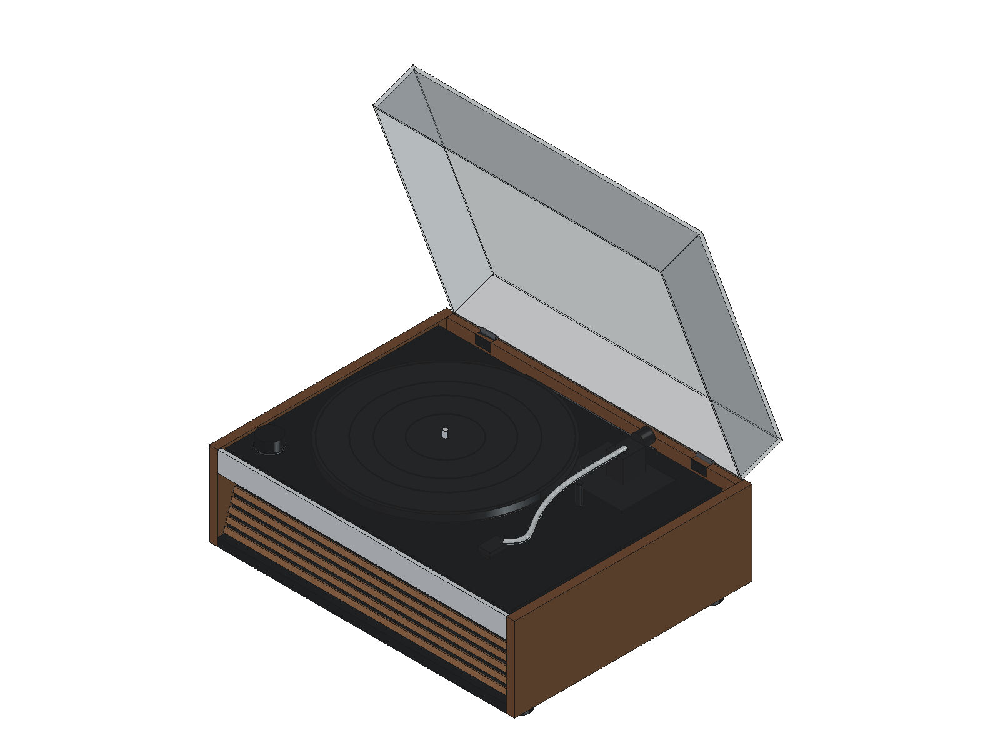
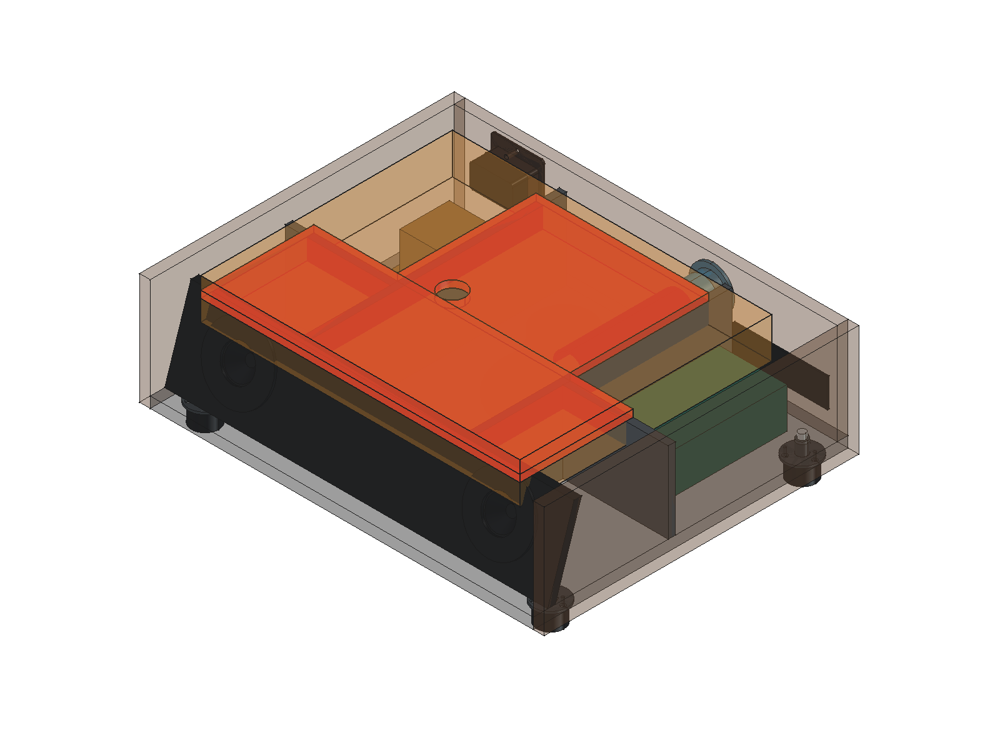

# 已选弯臂机芯与装配核对

选型为淘宝商品 `712086565319`、SKU `5162746531784` 的 **“28高端弯臂机芯全套餐装好直接用 自动回臂”**。套装图片包含机芯、功放板、机芯线、RCA 后板和电源线。商品详情未能读取，以下以用户提供的图片为依据；电气参数尚未确认。

## 尺寸依据

| 项目 | 当前处理 |
|---|---|
| 355 × 280 mm | 来自直臂款配图，借作弯臂款平面占位，尚未确认 |
| 280 mm 唱盘 | 暂按尺寸图近似，待核对弯臂款 |
| 10 mm | 图中箭头位于唱盘边缘，暂作盘厚占位；不能当作机芯总高或下探深度 |
| 安装面以下 45 mm | 项目自行假设的空间预留，不是商家规格 |
| 安装孔、底部轮廓、臂高及运动范围 | 未知；当前弯臂仅按照片近似停放姿态 |

原 v0.2 的 300 mm 唱盘、200 mm 唱臂轴距和 218 mm 有效长度不适用于这款机芯。来源图片见 [参考资料](../references/selected-mechanism/README.md)。

## CAD 与核对结果

[FreeCAD 核对装配](../cad/lumi-selected-mechanism-fit.FCStd) 和 [STEP](../cad/lumi-selected-mechanism-fit.step) 沿用 v0.4 SC-2103 的外壳与电子、音响布局，并替换上部机芯外观。[三单元基线](../cad/lumi-three-driver.FCStd) 保持独立，是本核对版的生成输入，须保留。两份文件可独立打开，但修改基线不会自动更新本核对版；需要按下方步骤重新生成。

| 继承部件 | 用户提供的外廓 | 仍待确认 |
|---|---|---|
| 低音 × 1 | 口端 Ø132 mm，总高 65 mm | 开孔、边沿厚度、孔位及背部轮廓；朝下安装 |
| 全频 × 2 | 口端 Ø78 mm，总高 40 mm | 开孔、边沿厚度、孔位及背部轮廓；朝前安装 |
| 共用变压器 × 1 | 本体 60 × 55 × 50 mm，固定耳总长 88 mm | 固定耳宽厚、孔距及高度基准 |
| 功放板 × 1 | 125 × 75 × 45 mm，已含散热片 | 安装孔、支柱、端子及散热条件 |

扬声器总高包含暂估的 3 mm 边沿，开孔仍暂估。RCA 后板继承 v0.4 的右后侧空间占位，备用电路板区域不代表需要另购唱放。布局及估算依据见[设计依据](design-basis.md)。



现有安装台面 Z=150 mm，声腔顶板上表面 Z=136 mm，只相隔 **14 mm**。若采用整个 355 × 280 mm 平面下探 **45 mm** 的矩形预留，需要比现有顶板多 **31 mm** 的竖向空间。预留包络还与承载板、部分支承、隔板、全频单元及低音倒相管等重叠，详见 [核对报告](../cad/mechanism-fit-report.json)。

这个矩形包络不是实际底部形状：真实机芯可能仅局部下探，**重叠不能证明实物必然碰撞，也不能据此直接降低整块声腔顶板**。承载板开口、弹簧支点和固定孔尚未设计。



图中橙色为假设下探空间，红色为它与声腔顶板的重叠部分。完整诊断实体保存在 FCStd 的 `FitAnalysis` 组内，默认隐藏；STEP 不导出这些诊断实体。

实体有效性及 STEP 回读的有效性、实体数、体积检查通过。示意上部在闭盖位置有约 16.2 mm 净空，但尺寸未确认，且没有验证自动回臂、唱片播放和开盖运动。报告中的 `installation_released` 始终为 `false`；本版用于讨论安装方案。

## 后续适配与重建

向商家取得弯臂款的底部安装图，至少包含安装基准、最大下探深度与位置、支点及孔距、上部最大高度。再据此确定台面开口、声腔避让和隔振支承。功放板还需补齐安装孔位、端子位置并核对供电、输出通道、负载和分频接法；套装不意味着能直接驱动当前三个扬声器。

参数入口按部件区分：[基线参数](../cad/parameters.json) 控制外壳、扬声器、变压器和功放；[机芯参数](../cad/selected-mechanism.json) 控制弯臂机芯占位及下探假设。

1. 先把手动改动另存。基线参数有变化时，按 [README](../README.md#v04-基线重建) 重建基线并运行 `tools/validate_model.py`；报告必须与刚保存的基线一致。
2. 关闭核对版文档，包括重新打开的 `lumi-selected-mechanism-fit.FCStd`。核对版脚本同时检查文档名及解析符号链接后的文件路径，拒绝覆盖仍打开的目标。
3. 在 FreeCAD 执行 `tools/mechanism-study.FCMacro`，生成核对版 FCStd、STEP、`mechanism-fit-report.json` 和两张预览。仅改机芯参数时可以直接执行此步，但输入基线须是已验证的当前版本。
4. 核对报告中的 `geometry_checks` 与 `fit`。几何及 STEP 检查通过不表示安装放行；当前 `installation_released=false`，仍有下探包络重叠。

核对版读取已保存的 `lumi-three-driver.FCStd`，不会自动读取最新基线 JSON 重建外壳，也不包含基线 GUI 内尚未保存的修改。报告的 `base_sha256` 绑定输入 FCStd；基线保存后若字节变化，应重建核对版再使用报告。

无 GUI 时可在仓库根目录运行：

```sh
PYTHONPATH=/Applications/FreeCAD.app/Contents/Resources/lib \
  /Applications/FreeCAD.app/Contents/Resources/bin/python tools/mechanism_study.py
```

该入口生成 CAD 与报告，不刷新 GUI 颜色和预览。`tools/validate_model.py` 的 30 项检查只针对 v0.4 基线，不能用来宣称此款机芯已适配。

音响布局详见 [SC-2103 三音腔设计](audio-layout.md)。低音腔向后延伸后，顶板与倒相管仍需按弯臂机芯真实底部重新核对。`BearingPocket` 是基线通用轴承的密封避让杯，在核对版中作为现有结构保留，不代表适配了选定机芯。
