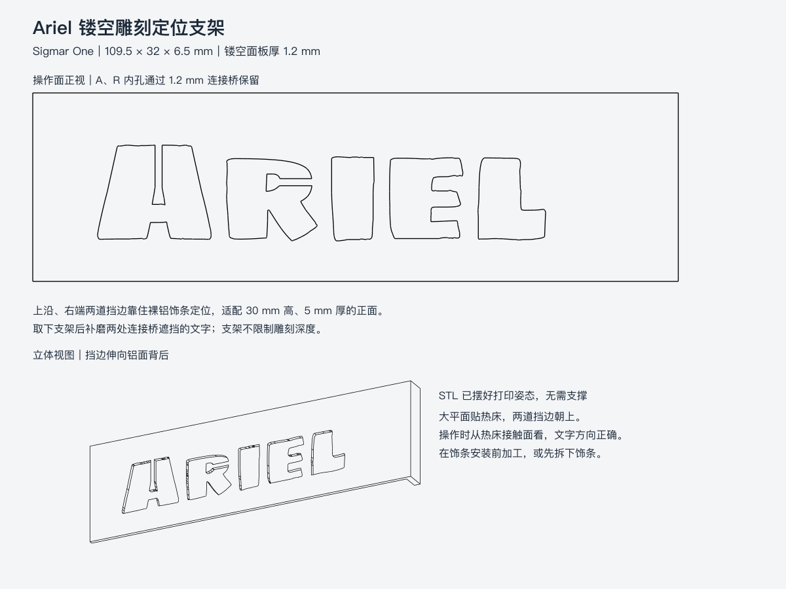

# Ariel 镂空雕刻定位支架

一件打印，无需镂空贴膜。适配本项目 **30 × 30 × 5 mm、长 425 mm** 的裸 T 型铝饰条：上挡边靠住饰条上沿，右挡边靠住切断端面；正面镂空为现有 **Ariel / Sigmar One** 字形，保持原 LOGO 的居中高度和右侧位置。



## 文件与尺寸

- [Ariel-stencil.stl](Ariel-stencil.stl)：直接导入切片软件，单位 mm；已摆好打印姿态。
- [Ariel-stencil.FCStd](Ariel-stencil.FCStd) / [STEP](Ariel-stencil.step)：同一打印姿态的独立工具模型。FCStd 保存了零件可见状态及等轴测视角，打开即可查看。
- [尺寸与几何检查](Ariel-stencil.json)：字形位置、连接桥和打印外廓。

| 项目 | 尺寸 |
|---|---|
| 打印外廓 | 109.5 × 32 × 6.5 mm |
| 接触铝面的镂空面板 | 1.2 mm 厚 |
| 上沿／右端挡边 | 2 mm 厚，向铝面背后伸出 5.3 mm |
| A、R 内孔连接桥 | 1.2 mm 宽；A 向上连接，R 向右连接 |
| 字形实际包络 | 约 75.992 × 16.261 mm，名义字高 16 mm |
| 字形右边缘距饰条右端 | 约 20.504 mm，沿用原 98 mm 铭牌画布内居中排字 |

这是两道定位挡边，没有弹性卡扣，也不限制刀具深度。连接桥、面板厚度和 5.3 mm 挡边深度是试用设计值；实物型材圆角、毛刺、打印收缩和刀头可达性需要试装核对。

## 打印

1. STL 按原尺寸 **100%** 导入，保持文件姿态：大平面在热床上，两道挡边向上，**不加支撑**。切片软件从上方看到的是背面字形；实际操作从热床接触面看，`Ariel` 方向正确，不要镜像模型。
2. 首版可用 PLA，0.4 mm 喷嘴、0.2 mm 层高、3 道墙；检查薄面板和两条连接桥被完整切片。若加 brim，避免孔内 brim，以免堵住字形。
3. 清除孔内拉丝、热床首层扩边和挡边毛刺；先空放到裸型材核对贴合与位置。不要用刀头修整模板孔边。

## 使用

1. **安装前加工，或先拆下饰条；不要带着整机磨。** 右挡边需要包住型材端部，装机后的 0.5 mm 木侧板间隙容不下 2 mm 挡边。上挡边也需要饰条上方空出来。
2. 在同材质边角料先试刻。固定铝条，再将支架的薄面贴紧正面，上挡边和右挡边都靠实，用普通胶带压住空白边缘或用夹具固定，防止跳动；普通固定胶带不充当文字遮罩。
3. 从字形内部开始浅磨、分次接近轮廓。使用适合铝材的细刀头，先确认刀尖能伸到铝面、刀杆能避开孔壁；**切削刃不要贴塑料边高速摩擦，也不要以挡边承受侧推力**。模板辅助定位，不能保证刀头不越界或刻深一致。
4. A 和 R 的连接桥会挡住两小段文字。取下支架后补磨这两段；若喜欢带桥的模板字效果，也可以保留。
5. 固定工件、佩戴护目镜；工件和模板发热或模板边缘受损时停机检查。银色铝面浅磨的对比度取决于原表面处理，先用试刻结果决定效果。

## 重新生成

使用 FreeCAD 1.1.1，在 **GUI 中**执行 [build-logo-stencil.FCMacro](../../tools/build-logo-stencil.FCMacro)。先关闭旧的 `Ariel-stencil.FCStd`；需要保留的手动编辑先另存副本。生成器会拒绝覆盖当前已打开的目标文件，包括指向同一文件的符号链接路径。

在 FreeCAD 的“宏 → 宏…”中，将用户宏位置设为仓库的 `tools/`，选择 `build-logo-stencil.FCMacro` 并执行。FreeCAD 尚未启动时，也可以从仓库根目录运行：

```sh
open -a FreeCAD --args "$PWD/tools/build-logo-stencil.FCMacro"
```

宏生成全部工具文件，保存零件可见性与视角，再重开导出的 FCStd 检查默认显示；它不保存其他已打开文档。直接用无界面 Python 执行生成器会被拒绝，以免再次导出缺少 GUI 显示信息的 FCStd。

宏完成后，从仓库根目录转换 PNG 并运行检查。PNG 转换另需 `rsvg-convert`；测试使用 `FREECAD_RESOURCES`，环境设置见 [整机重建的运行环境说明](../../README.md#整机重建)。

```sh
rsvg-convert previews/logo-stencil.svg -o previews/logo-stencil.png
PYTHONPATH="${FREECAD_RESOURCES:?请先设置 FreeCAD 运行环境}/lib" \
  "$FREECAD_RESOURCES/bin/python" -m unittest discover -s tests -p 'test_logo_stencil.py' -v
```

生成器读取现有 `cad/parameters.json` 的饰条与排字尺寸，复用仓库字体；面板、挡边和连接桥尺寸在 `tools/build_logo_stencil.py` 中定义。执行后覆盖本目录四种导出文件及 `previews/logo-stencil.svg`，PNG 单独转换。生成器新建并关闭独立工具文档，宏随后重开它用于查看，不打开或修改整机主 CAD。FreeCAD 自动备份沿用仓库忽略规则，不作为交付文件。

## 验证状态

2026-09-30 的实现验证已完成：

- `test_logo_stencil.py` 的 6 项检查通过：内孔连接与闭合网格、裸饰条挡边贴合无穿透、平面朝下的打印姿态与字形旋转、文字边距与临时对象清理、无界面导出拒绝写文件、保存的 GUI 可见状态与相机信息。
- STL 回读为闭合网格、1 个连通分量；STEP 回读为 1 个有效实体；FCStd 回读为 1 个有效工具对象。
- GUI 重开确认 `ArielStencil.ViewObject.Visibility=True`，实际三维视口确认零件显示。原无界面导出缺少 `GuiDocument.xml`，已通过 GUI 宏重新保存修复。
- 已目视检查实际实体投影的正视／立体预览，A 向上、R 向右的连接桥位置与操作面的文字朝向正确。

工具单独交付，不加入整机装配、整机 STEP 或零件清单；现有激光铭牌模型仍保留为另一方案。以上是几何与文件验证，**尚未进行实物打印或雕刻试用**；后续待办统一记录在 [当前工作交接](../../docs/current-work-handoff.md#已知问题与待修项)。
