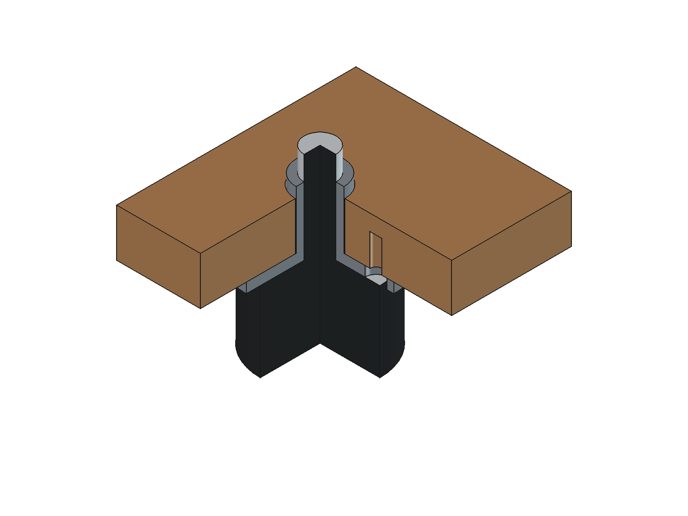

# 已购脚垫与固定座

用户于 2026-09-22 确认购买以下脚垫及固定座，并提供两张商家尺寸图。购买选择已确认；下表尺寸来自图片标注，尚未实测。商品页面本次无法读取，链接及 SKU 按用户提供的原样记录。

## 购买链接

| 配件 | 购买页面 | 商品 ID | SKU ID |
|---|---|---|---|
| VE 型橡胶脚垫，Ø30 × 20 mm，M8 × 23 mm 螺杆 | [天猫购买链接](https://detail.tmall.com/item.htm?id=935514441456&skuId=5993247083741) | 935514441456 | 5993247083741 |
| M8 × 37 固定座，镀黑锌、大号冷镦加厚款 | [天猫购买链接](https://detail.tmall.com/item.htm?id=754292834429&skuId=5202344405597) | 754292834429 | 5202344405597 |

固定座图片写有“数量：5 只”，这是图片中的包装标注；实际到货数量待核对。当前 CAD 有四个脚垫位置。

## 原始图片与尺寸

- [脚垫原图](vendor-foot-dimensions.png)：用户原始 PNG，未改动。
- [固定座原图](vendor-mount-dimensions.png)：用户原始 PNG，未改动；商家注明为单批次测量数据，以实物为准。

图片版权归原权利人，项目许可证不覆盖这些图片。

| 配件 | 项目 | 原图标注 |
|---|---|---|
| 脚垫 | 类型 | VE 型 |
| 脚垫 | 橡胶直径 × 高度 | Ø30 × 20 mm |
| 脚垫 | 螺杆规格 × 外露长度 | M8 × 23 mm，自橡胶顶部起计 |
| 固定座 | 内螺纹 | M8，螺距未标注 |
| 固定座 | 底盘直径 / 厚度 | Ø37 / 2.5 mm |
| 固定座 | 圆柱外径 / 高度 | Ø12 / 14.5 mm，圆柱高度不含底盘 |
| 固定座 | 总高度 | 17 mm，与 14.5 + 2.5 一致 |
| 固定座 | 固定孔孔径 | Ø5.5 mm；图片可见三个孔，未标孔距或分布圆直径 |

“M8 × 37”中的 37 指底盘直径，不是螺纹长度。两件名义螺纹均为 M8；实际螺距、有效啮合长度及是否能顺畅旋合仍需实物核对。

## 当前 CAD 安装方式

用户已确认采用**底盘贴底板下表面、圆柱向上穿板、橡胶顶面贴底盘下表面**的方案。`v0.7-purchased-feet` 已替换四个占位脚垫，并加入四个独立固定座和底板安装孔；脚垫总成保留 `Foot0`–`Foot3`，固定座为 `FootMount0`–`FootMount3`。M8 螺纹以 Ø8 名义圆柱／通孔表示，未画螺旋牙形；橡胶顶部金属片厚度未给出，不另加高度。

| 部位 | 当前模型坐标／尺寸（mm） |
|---|---|
| 四个中心 | X=33 / 417；前排 Y=40，后排 Y=320 |
| 橡胶 | Z=0–20，Ø30 |
| 螺杆 | Z=20–43，名义 Ø8 |
| 固定座底盘 | Z=20–22.5，Ø37 |
| 固定座圆柱 | Z=22.5–37，外径 Ø12 |
| 木底板 | Z=22.5–34.5，厚 12 |
| 圆柱高出底板 | 2.5 |
| 螺杆高出固定座 | 6；包络轴向重叠 17，非实测有效螺纹长度 |

前排中心从旧占位 Y=30 后移至 40，避免圆柱和螺杆与倾斜前障板重叠。名义未压缩离地高度是 **20 + 2.5 = 22.5 mm**；木壳仍高 124 mm，箱体及内部件整体下移 3.5 mm，闭盖总高由 214.2 mm 变为 **210.7 mm**。低音最低点离桌面 **19.5 mm**，低于此前 20 mm 试验目标；报告单列该目标未满足，声学出声空间仍待样机验证。

剖视临时裁切底板、脚垫和固定座，仅为说明安装关系，不改变保存模型。未画螺钉；尺寸详图见第一册 A-P07，底板见 A-P01。

## 安装假设与待实测项

- 固定座三个 Ø5.5 孔按 **Ø28 分布圆**、从 +X 起 0°／120°／240°建模；孔距是暂估，不从透视图反推加工尺寸。
- 底板中心孔暂取 **Ø12.4 通孔**。固定座圆柱外径 Ø12 mm，名义径向间隙 0.2 mm；实际木板与金属件须试孔。
- 每座底板下表面暂开 **3 × Ø3 mm、深 8 mm 的盲预孔**，余木 4 mm；与固定座三孔同心。预孔为木螺钉方案假设，紧固件规格未选定。
- **22.5 mm 是理想贴合高度，不含未选螺钉头凸出、垫片或锁紧件。** Ø30 mm 橡胶会接近固定孔区域；需核对螺钉头与橡胶的避让，不能凭本模型认定已可直接装配。若需垫高或改紧固方式，应更新离地高度并重新验证。
- 保存几何检查四套实体与底板、障板及电子件的干涉，并检查通孔和盲预孔形状。音腔闭合依赖底盘、底板及橡胶的理想接触；实际螺纹及接缝不保证气密，密封措施待确认。

有效螺纹深度、实物螺杆端部余量、橡胶压缩量、承载和隔振仍待测；脚垫与固定座对象均标记 `InstallationReleased=false`。采购记录和名义几何不构成加工或安装放行。

## 参数与重建

修改 `cad/parameters.json` 的 `feet` 对象后，按[基线重建](../../README.md#v07-基线重建)生成并验证，再重建机芯核对版、图册和导览。保存实体不会自动响应 JSON 修改。

- `rubber_*`、`stud_*`、`flange_*`、`barrel_*` 和 `mount_hole_diameter` 记录名义零件尺寸；带 `_assumption` 后缀的孔距、板孔和预孔参数为安装假设。
- `side_inset`、`front_y`、`rear_inset` 控制脚位；右侧 X 与后排 Y 分别由箱宽、箱深减去边距得到。固定孔的三个角度当前由代码固定为 0°／120°／240°。
- 当前仅实现圆柱向上、橡胶贴底盘的安装方式，要求 `foot_height = feet.rubber_height + feet.flange_thickness`。改变橡胶高度或底盘厚度时，必须同时更新 `foot_height`，否则生成器拒绝构建。
- 若要保持箱体自身尺寸和内部相对位置，离地高度的差值还须同步到 `cabinet_top`、`closed_height`、`cover_bottom`、`fullrange.center_z`、`acoustic.roof_bottom_z`、`bass_port.center_z`、`phono_board.z` 和 `ac_inlet.center_z`；生成器不会自动调整这些绝对坐标。
- 当前代码还要求螺杆长度大于固定座总高，盲预孔深度小于底板厚度。加入垫片、锁紧件或改变固定座朝向需要修改安装几何，不能仅改 `foot_height`。

`tools/build.FCMacro` 同步输出 `previews/feet-installation.png`，该图由 `render_foot_detail()` 在临时文档中生成。基线验证的 `feet_*` 检查涵盖零件形状、底板孔、干涉与支承；`metrics.feet` 记录脚位、螺杆突出及盲孔余木。低音旧试验目标单独记录为 `metrics.woofer_previous_20mm_trial_target_met=false`，几何检查通过不表示该目标已满足。
