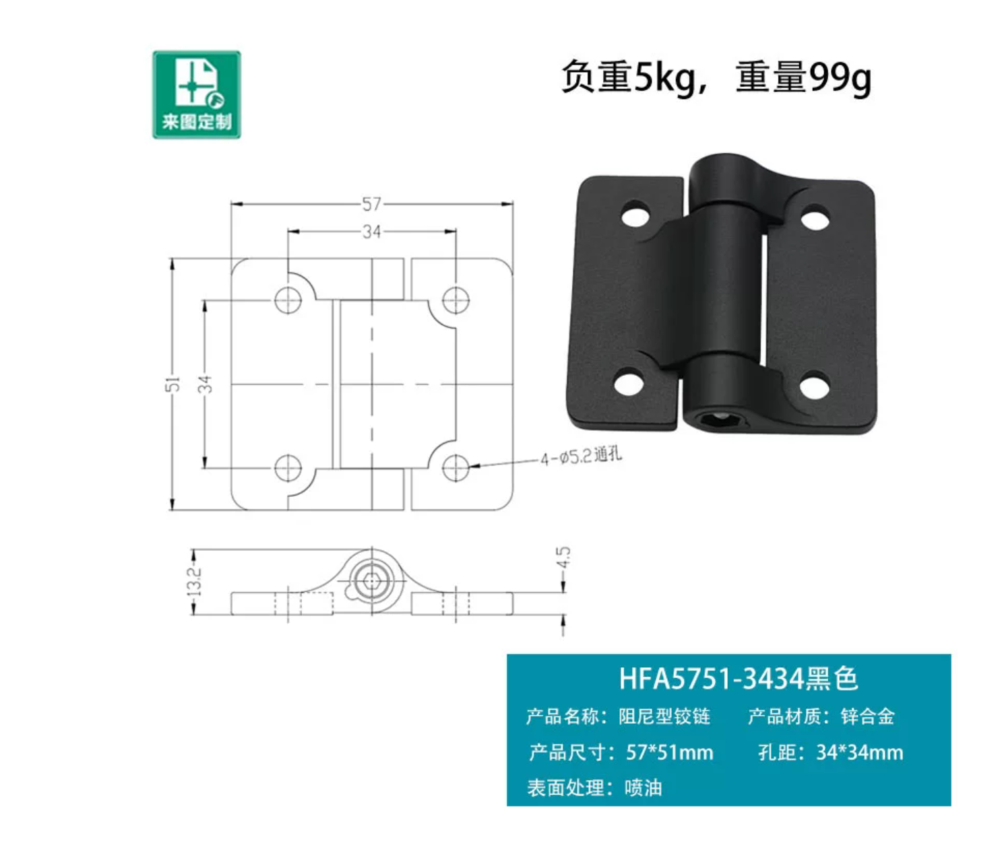
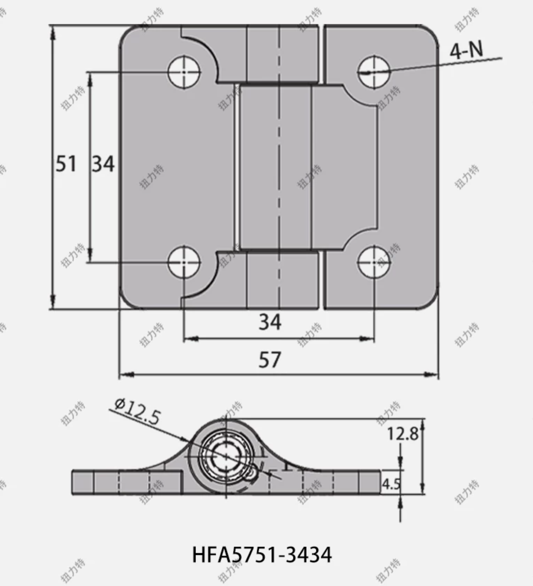
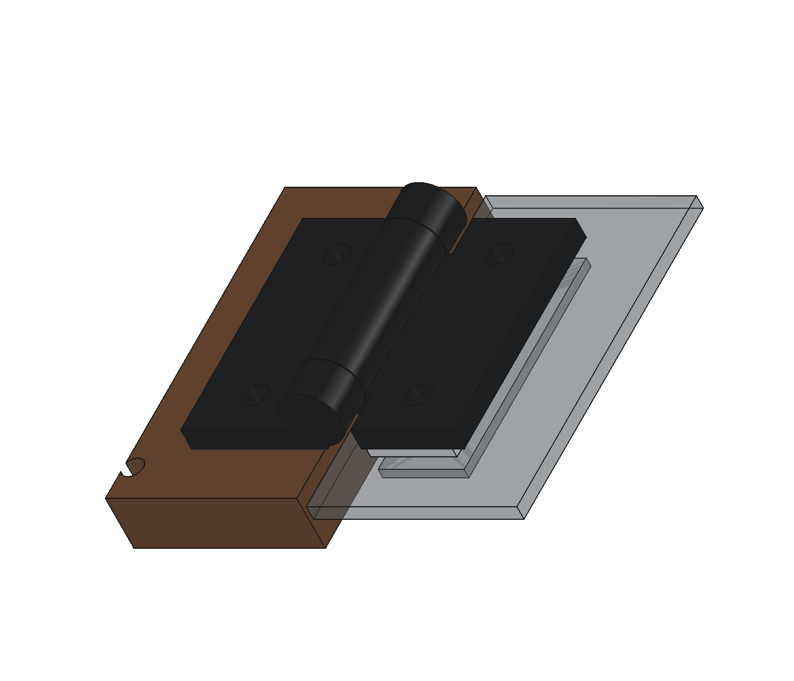

# HFA5751-3434 可调定位合页

2026-09-23 用户选定黑色 HFA5751-3434，用于防尘盖，共 2 只。用户补充“最大可到 3 N·m”；这条信息来自用户，不是项目实测的保持扭矩。暂按单只最大值理解，单只／整对口径、可调下限、容差和寿命后保持能力仍待实物或供应商确认。

## 购买链接与原图

- [淘宝：可调阻尼任意停定位合页](https://item.taobao.com/item.htm?id=750399927294&skuId=5175201965803)
- 商品 ID：`750399927294`；SKU ID：`5175201965803`。
- [商品及尺寸原图](vendor-product-dimensions.png)：HFA5751-3434 黑色，含 5 kg／99 g 宣传标注。
- [第二张尺寸原图](vendor-drawing.png)：相同型号，含 Ø12.5 标注。

两张用户附件按原文件复制保存，未裁切或改写。商品页面未能读取；登记 URL 和 SKU 不表示验证商品参数。原图版权属于原权利人，不包含在本仓库许可内。

## 尺寸来源和冲突

| 参数 | 图示／用户信息 | 当前建模口径 |
|---|---|---|
| 展开外廓 | 57 × 51 mm，两图一致 | 旋转轴沿整机 X，沿轴长 51、跨上下叶高 57 |
| 孔距 | 34 × 34 mm，两图一致 | 上下各两孔，左右／上下孔距均 34 |
| 孔径 | 图一 4 × Ø5.2 通孔；图二写 4-N | 采购叶片 Ø5.2 |
| 叶厚 | 4.5 mm，两图一致 | 平叶厚 4.5 |
| 总厚 | 图一 13.2、图二 12.8 mm | 保守按背面起 13.2 mm 预留 |
| 筒径 | 图二 Ø12.5 | 暂作外筒直径；需确认其标注对象 |
| 轴心 | 未单独定位 | 由 13.2 与 Ø12.5 推算距安装面 6.95 mm，为假设 |
| 材质／重量 | 图一锌合金／99 g | 材料记录；不按简化实心 CAD 反推采购件质量 |
| 最大扭矩 | 用户补充 3 N·m | 记录信息来源；没有扭矩曲线／寿命证据 |
| 负重 | 图一 5 kg | 未给测试力臂与数量，不能据此验证悬停 |

轴筒分为两端固定、中间活动的简化结构，筒节轴向隙 0.2 mm。叶片根部曲面、外角圆角及调节螺钉、内摩擦机构、安装螺钉和螺母未建模；无圆角包络不代表真实外形完全重合。随意停功能不等同于缓降。

## v0.9 安装布局

`cad/parameters.json` 的 `hinges` 参数由 `tools/hinges.py` 生成几何。保留 `HingeBase0/1` 为固定叶，`HingePin0/1` 改为活动叶及中间轴筒；每一组两叶合计 **1 只采购合页**。另有 `HingeSpacer0/1` 和 `HingeBacking0/1` 各 2 件。

- 两只中心 X=100／350 mm，关于箱体中线 X=225 对称，距各自箱体外侧均 100 mm；整套固定叶、活动叶、补偿垫片、压板及孔位一同定位。AC 插座下移 16 mm 至 Z=88.5，其法兰上沿与固定叶下沿间隙 5.5 mm；变压器前移 10 mm 至 Y=267，为原有 20 mm 接线预留保留 6.72 mm 间隙。位置是本项目安装选择，并非厂家规定。
- 共用轴线 Y=356.95、Z=147 mm，位于木箱顶面 Z=146.5 与盖底 Z=147.5 的中间高度；轴平行 X。
- 木后板外表面 Y=350；透明盖后表面 Y=348。上叶与盖之间加 **2 mm 铝补偿垫片**；罩内侧加 **2 mm 铝压板**，垫片及压板均为 **51 × 18 mm**。
- 上盖、垫片及压板各为两组 2 × Ø5.5 通孔，拟配 M5 螺栓（安装假设）。压板范围 Y=343–345，垫片 Y=348–350，范围 Z=155–173 mm。
- 木后板侧为 **4 × Ø3、深 8 mm 后侧盲预孔**，保留 4 mm 内侧木厚。实际木螺钉、木材拔出强度和头部压紧方式尚未确认；不得把 Ø3 预孔当成 Ø5.2 采购叶孔。
- 闭盖木箱深仍为 350 mm；合页后凸 13.2 mm，当前闭盖总外廓 **450 × 363.2 × 210.7 mm**。外接插头／线缆和未建模紧固件不包含在该外廓中；开盖扫掠空间另计。

从后方看，1 号合页（对象后缀 `0`，中心 X=100）位于画面右侧，2 号（后缀 `1`，X=350）位于画面左侧；整机坐标不随视角翻转。下表的板件局部 X 均以整机 X=12 为零，木后板局部 Z 以整机 Z=34.5 为零，盖后壁局部 Z 以整机 Z=147.5 为零。

| 安装孔 | 整机 X | 整机 Z | 从板件左下角量取 |
|---|---|---|---|
| 木后板 4 个盲预孔 | 83／117／333／367 | 130 | X=71／105／321／355，Z=95.5 |
| 透明盖后壁 4 个通孔 | 83／117／333／367 | 164 | X=71／105／321／355，Z=16.5 |
| 每块垫片／压板的 2 孔 | 随对应上盖孔 | 164 | X=8.5／42.5，Z=9 |

木板孔见 A-H02；盖后壁孔见新增 A-H03；合页叶片沿用 A-P06，垫片／压板见新增 A-P08。保留脚垫 A-P07 及其他旧图号。孔边距、倒角去毛刺、亚克力装配间隙、隔离垫与紧固力均须试装确认。压板已建模，隔离垫和紧固件尚未建模。

## 扭矩估算与验证边界

回读钻孔后的五面盖壳，按密度 1.18 g/cm³ 假设，裸盖约 0.848 kg。新轴线下，闭盖附近重力矩约 **1.514 N·m**，理想均分约 **0.757 N·m／只**。此估算不含活动叶、垫片、压板和螺栓质量；不能作为完成装配的负载实测。

两只各 1.0–1.2 N·m 可作为初始调试目标，随后按完整盖总成称重、重心和多角度悬停效果调整。不要仅按最大值拧紧：这会增加开盖力和亚克力安装受力。未把“3 N·m”转换为模型的承载通过结论。

基线验证回读保存实体，机芯核对版报告检查生成中的实体并回读其 STEP；两者均检查固定叶邻件，以及 **盖壳＋活动叶＋补偿垫片＋内压板**在 0–70° 每 1°共 71 个姿态的干涉。孔道、孔边材料和盲孔余厚另有检查；抽样无干涉不是连续扫掠求解，也不是实物扭矩、磨损、亚克力强度或安全限位验证。安装状态保持 `installation_released=false`。

下一步实物核对：确认 13.2／12.8 尺寸和轴线；先做木板／亚克力试装件；装齐紧固件后从小角度至70°检查悬停、手感与碰撞，并复测多次开闭后的保持能力。70°目前是检查角度，尚无机械限位件。

## 参数与重建

修改 [cad/parameters.json](../../cad/parameters.json) 中的 `hinges` 后，按 [README 重建流程](../../README.md#v09-基线重建) 依次重建基线、运行基线验证、重建机芯核对版，再生成图册及导览。模型是保存的静态实体，修改 JSON 不会直接更新 FCStd。

当前对称布局使用以下三个独立参数；修改其中一个不会自动移动另外两个部件。调整后应保留并重新检查接线预留，不能仅移动 GUI 中的活动叶。

| 参数 | 当前值（mm） | 控制范围 |
|---|---|---|
| `hinges.center_x` | `[100, 350]` | 两套合页、补偿垫片、压板及对应板孔 |
| `ac_inlet.center_z` | `88.5` | 插座、后板开孔和接线预留的高度 |
| `power_transformer.center_y` | `267` | 变压器前后位置；Y 减小为向前 |

插座详细孔位和内部空间见 [AC 安装记录](../ac-inlet/README.md#项目安装位置)。当前两合页中心之和等于箱宽 450 mm；这是参数选择，生成器不会自动强制对称。

`center_x` 决定合页横向位置；`hole_pitch`、`hole_diameter` 和 `leaf_thickness` 描述采购叶片。盖孔、木预孔、压板和筒节间隙均使用带 `_assumption` 的字段。轴线由 `depth`、`cabinet_top`、`cover_bottom`、假设总厚和筒径计算；当前盖后壁内缩 2 mm 及对应补偿厚度在建模逻辑中固定，改变这一安装方式须同步修改几何，不能只调整压板厚度。

安装孔、盲孔余木及垫片／压板外廓、厚度和局部孔心的图纸说明由参数生成；对应的非默认参数回归见 [tests/test_drawing_pack.py](../../tests/test_drawing_pack.py)。

`max_torque_user_reported_nm`、`torque_scope` 和 `initial_torque_target_per_hinge_nm` 是来源／调试记录，不控制摩擦仿真；CAD 不模拟静摩擦、缓降或实际悬停。专用回归为 [tests/test_hinges.py](../../tests/test_hinges.py)，覆盖保存孔位、填堵／打穿盲孔、活动压板碰撞及孔表坐标。待办统一保留在[当前工作交接](../../docs/current-work-handoff.md#已知问题与待修项)。
